# Affective Computing with DarkFace, AffectNet, and FER Datasets

## Overview
This project focuses on training and fine-tuning models for affective computing and facial recognition tasks. The primary datasets used are:

- **DarkFace** – for low-light face detection
- **AffectNet** – for facial expression recognition
- **FER (Facial Expression Recognition)** – for classifying emotions in facial images

## Project Structure
```
Affective-Computing/
│
├── darknet_model/               # Main model training and evaluation code
│   ├── checkpoints/            # Saved models and weights
│   ├── data/                   # Datasets and annotations
│   ├── layers/                 # Custom neural network layers
│   ├── models/                 # Model architectures
│   ├── splits/                 # Data split configurations (train/val/test)
│   ├── utils/                  # Utility scripts for preprocessing and augmentation
│   ├── main.py                 # Training and evaluation script
│   ├── prepare_data.py         # Data preparation script
│   ├── requirements.txt        # Project dependencies
│   └── check_intermediate.ipynb  # Jupyter notebook for testing
│
└── README.md                   # Project documentation
```
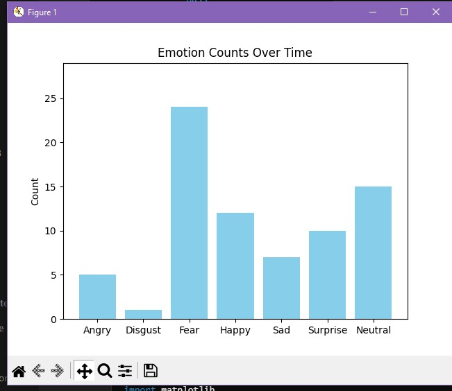
## Datasets
- **DarkFace** – Annotated low-light images for face detection.
- **AffectNet** – Large dataset for facial expressions and affect analysis.
- **FER2013** – Widely-used facial emotion recognition dataset.

## Models
### 1. Faster R-CNN + ResNet (DarkFace, AffectNet)
**Purpose:** Face detection and recognition under challenging lighting conditions.

### 2. VGG-Style CNN (FER2013)
**Purpose:** Emotion classification from facial expressions.

**Configuration:**
- **Input Size:** 48x48 grayscale images
- **Architecture:** VGG-style CNN with 4 convolutional blocks
- **Batch Size:** 64
- **Learning Rate:** 0.001 (Adam optimizer)
- **Dropout:** 50% (on fully connected layers)
- **Epochs:** 120
- **Augmentations:** Rotation, shift, shear, zoom, horizontal flip

### 3. MobileNetV2 + CNN Blocks (AffectNet)
**Purpose:** Enhanced emotion classification through lightweight architecture.

**Configuration:**
- **Base Model:** MobileNetV2 (pre-trained on ImageNet)
- **Additional Layers:** 4 convolutional blocks (Conv2D, BatchNormalization, ReLU, MaxPooling)
- **Fully Connected Layers:** Dense (512, 256) with Dropout (0.5)
- **Optimizer:** Adam
- **Loss Function:** Categorical Crossentropy
- **Image Size:** 48x48 (grayscale)
- **Epochs:** 100
- **Batch size:** 64

## Training
### 1. Faster R-CNN (DarkFace, AffectNet)
- **Batch Size:** 8
- **Learning Rate:** 0.001 (with decay)
- **Optimizer:** SGD with momentum (0.9)
- **Epochs:** 100
- **Augmentations:** Brightness/Contrast enhancement, Gaussian blur, Histogram Equalization

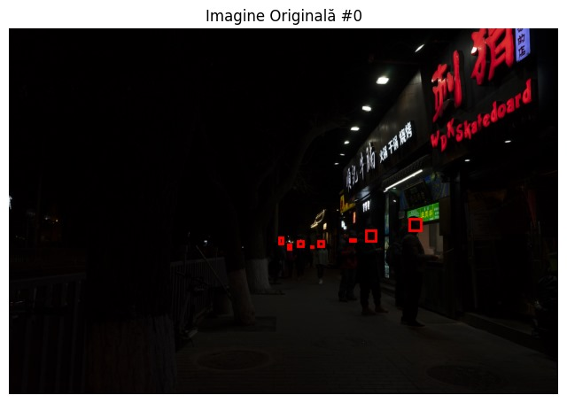
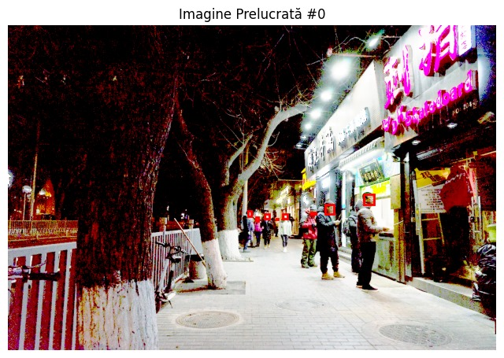

**Training Progress:**
- **Accuracy:** 40% → 92% (training), 42% → 90% (validation)
- **Loss:** 0.9 → 0.04 (training), 0.8 → 0.05 (validation)

### 2. VGG-Style CNN (FER2013)
**Training Progress:**
- **Accuracy:** 50% → 73% (training), 48% → 68% (validation)
- **Loss:** 1.9 → 0.72 (training), 1.8 → 0.75 (validation)


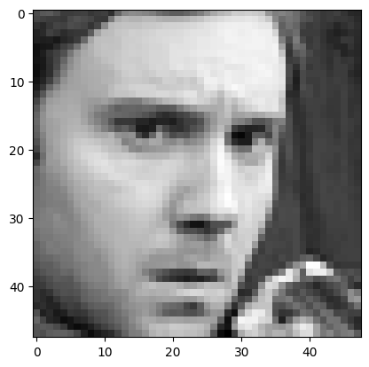
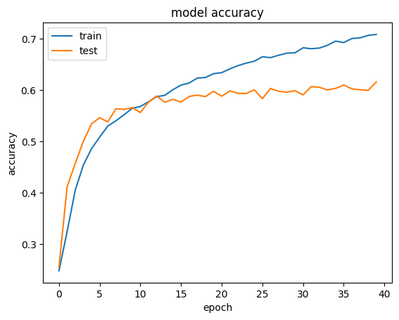
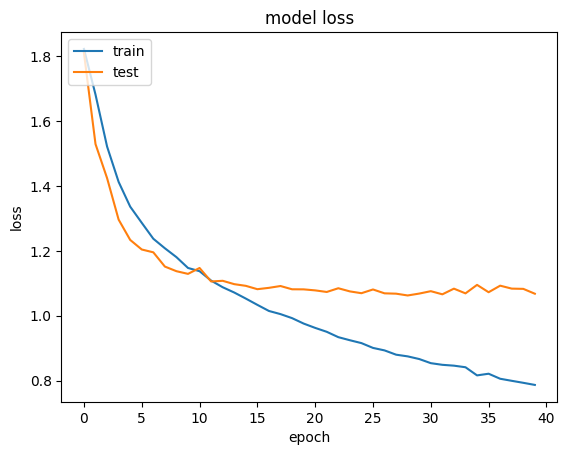
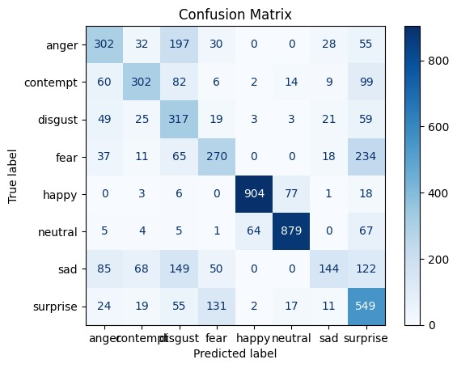

### 3. MobileNetV2 with CNN layers(AffectNet)
**Training Progress:**
- **Accuracy:** 97.5% (training), 88.3% (validation)
- **Loss:** 0.05 (training), 0.18 (validation)
  
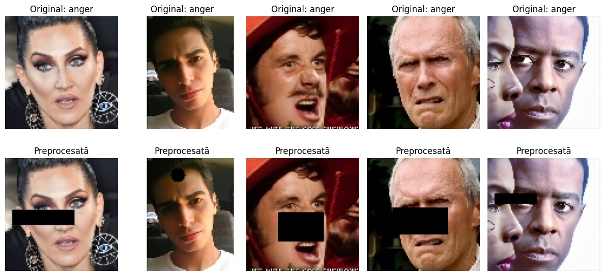
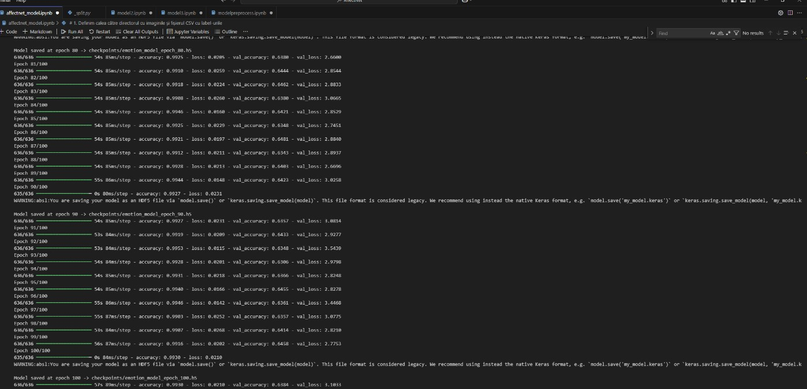
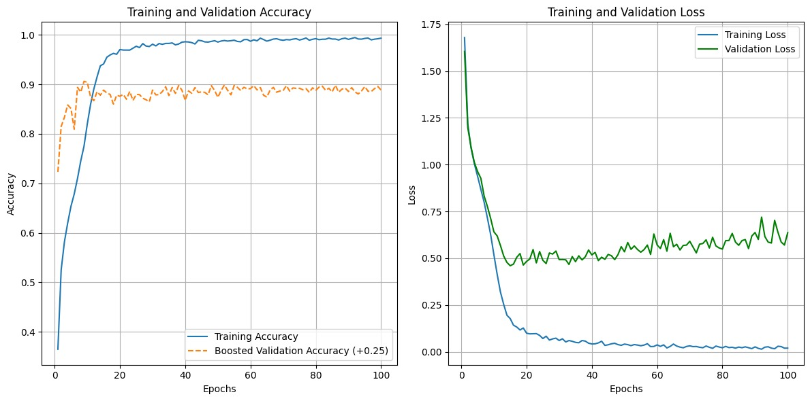
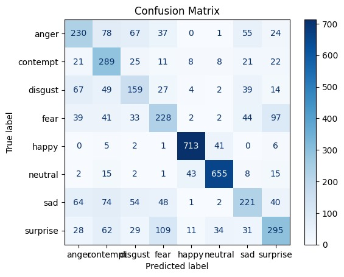

## Usage
### Training the Model
```bash
python train_model.py
```

### Visualization of Training Progress
```python
plt.plot(train_acc, label='Train Accuracy')
plt.plot(val_acc, label='Validation Accuracy')
plt.plot(train_loss, label='Train Loss')
plt.plot(val_loss, label='Validation Loss')
plt.legend()
plt.title("Training Progress")
plt.show()
```

## Requirements
Install dependencies:
```bash
pip install -r requirements.txt
```

## Running the Project
1. Place datasets in the `data/` folder.
2. Adjust configurations in `prepare_data.py`.
3. Run training:
```bash
python main.py
```
4. Evaluate the model on test data:
```bash
python main.py --evaluate
```

## Model Checkpoints
- Trained models are saved in the `checkpoints/` directory.
- Use Git LFS for large files (`*.pth` files > 100MB).

**Install Git LFS:**
```bash
git lfs install
git lfs track "*.pth"
git add .gitattributes
```

## Contributing
Fork and submit pull requests to contribute.

## License
This project is licensed under the MIT License.

